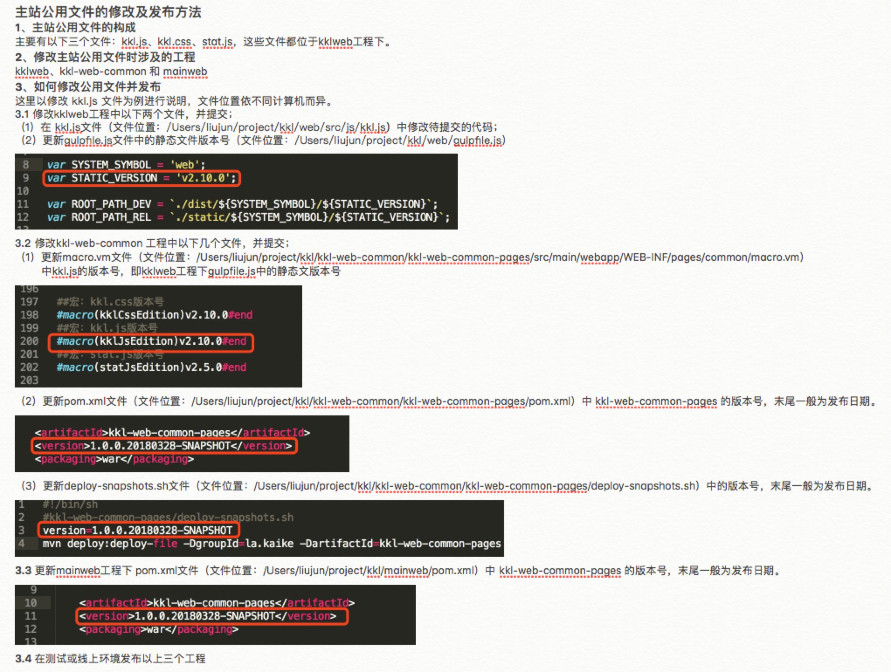

## 项目开发流程

### 项目通用流程
需求评审 —— UI评审 —— 系分评审 —— 开发 —— 联调自测 —— 功能测试 —— 发布评审 —— sit回归测试 —— 预发验证 —— 发布上线

注：

系分评审：视项目复杂度确定是否进行系统分析，建议有

联调自测、功能测试：stable环境（*.stable.ikuko.com）具体连接网关地址由后端确定

功能测试：测试人员介入，禅道bug录入跟踪

sit回归测试：sit环境（*.ksit.kaikela.cn）

预发验证：预发环境（详见下方预发host配置），使用线上数据库
### 开发流程 
* clone前端相关git工程；  
* 执行npm install  
*  建立feature分支开发（单人开发时基于mater分支建立，多人开发基于统一版本develop建立）需要在http://wiki.ikuko.com/pages/viewpage.action?pageId=2164359中填写开发分支及备注信息  
* feature分支合到develop分支（多人开发时），然后使用develop分支部署到stable环境（联调和功能测试环境）  
* develop分支合到trunk分支，然后把trunk分支部署到sit环境（集成测试环境）需要在http://wiki.ikuko.com/pages/viewpage.action?pageId=2164361中填写发布信息涉及的git库和是否合并到trunk
    分支等信息  
* trunk分支部署到release分支，然后进行预发  
* 发布完成后release分支合并到trunk、master  

### 主站kkl-web版本升级
* 主站公用文件包含kkl.js 、kkl.css、 stot.js该文件在kkl-web中被引用
* 若修改公用文件，需要升级三个工程的版本号kkl-web、kkl-web-common和你当前所改的模块对应的后端工程例如（mainweb、memberweb、fm-web、orderweb、community-web、authweb）

